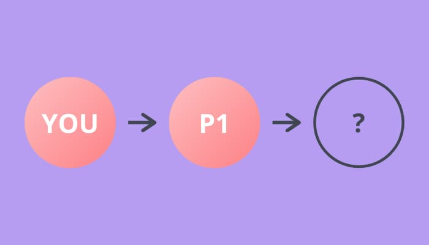

Some coworkers and I were having a crack at the following puzzle a few weeks ago:

> Consider a party with N people. Everyone writes down their name on a piece of paper and throws it in a bag. We shake up the bag and each person draws one name from the bag. You are in the same group as the person you drew. What is the expected number of groups?

I'm not nearly smart enough to figure this beauty out, so I thought I'd estimate it instead.

## What are we estimating?

First, we need to figure out what we're actually estimating. The question asks for the *expected number of groups.* The question states that *you are in a the same group as the person you drew.* This also means that you're in the same group as the person that they drew and so on.

Let's look at what happens as we build up the chain to see if there are any details that we can latch on to.

Say you draw first, and you pick person "P1". This is how the relationships look so far.



Next, P1 picks someone out of the bag. They can either pick you, or someone else at the party.


If they don't pick you, P2 picks next. Again, there are two possibilities here — they can pick you or some other person at the party. And so on for P3. Eventually there will be no other people at the party & you *must* be picked.


Hopefully this convinces you that everyone at the party must be a part of a *loop* of people — also called a *cycle* in graph theory. In fact, the relationships can be represented using a *[directed graph.](https://en.wikipedia.org/wiki/Directed_graph)*

These "cycles" are the groups that the question refers to. So, to count the number of groups, we just need to count the number of cycles. To do this, we can construct a directed graph & walk it, starting from each person to find the number of cycles.

## How do we generate a sample party?

Now that we know what we're estimating, we need to generate some data at random. What we want to generate is a directed graph, with a handful of constraints. Those constraints are:

1. Each node only exactly one "out edge" *(because a person's name only appears in the bag once)*
2. Each node only exactly one "in edge" *(because a person draws a single name)*

The algorithm is pretty simple, and models the scenario quite nicely. First, make a set with all of the "people" in it (we'll just use numbers from 0 to N). Then loop over all the "people", from 0 to N, removing a random person from the set. Finally, put this pair into a map.

```python
pairs_of_people = dict()
remaining_people = set(range(N))
for person_a in range(N):
  person_b = get_random_element(remaining_people)
  remaining_people.remove(person_b)
  pairs_of_people[person_a] = person_b
```

We now have our "edges" for our directed graph. I'll leave out the implementation of the graph here as I don't think it's that interesting, but if you're curious you can check it out in the linked gist at the end.

## How do we count the groups?

To count the groups, we need to walk the graph. To do this, we pick a random person and then "visit" the person they are linked to until we reach the person we started with. This means we've visited every person in a single group. Next, we pick another random person we haven't visited yet and start again. The number of times we do this is the total number of groups.

```python
relationship_graph = DirectedGraph.from_edges(pairs_of_people)
seen = set()
groups = 0

for n in range(N):
	if n in seen:
		continue
	
	seen_on_this_walk = relationships.walk(n)
	seen.update(seen_on_this_walk)
	groups += 1
```

## How do we estimate?

Now that we have all of the pieces, we can estimate the answer for different values of N. To do this, we'll need to count the number of groups in some sample data many many times (say, 1000) to get a reasonable estimate. We can then plot these points on a graph and see if we can spot anything.

Here's that plot. Estimate in blue, real answer in red. Not bad I think.


Check out the [observable hq notebook](https://observablehq.com/@chrfrasco/groups-at-a-party) to see the code.
