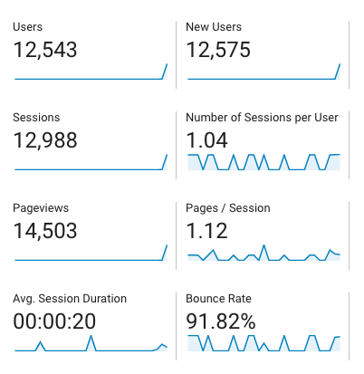

Last night I submitted a post of mine to hacker news called [“Making rust as fast as go”](). It was rather popular – I’m not sure what the highest position it got to was, but I saw it hit at least the number 3 spot.

I have two analytics providers set up on my site – google analytics, and netlify analytics. They each collect data in quite different ways. Google analytics tracks via an embedded javascript snippet, whereas Netlify tracks page views on the server. This means that Netlify is able to track every single page view, rather than just the ones that aren't blocking trackers.

Google analytics says that there were about 13,000 unique visitors overnight. This is a mind blowing number of people.

Compare this to Netlify. I expected there to be a gap, but I did not expect it to be this big:

Close to 34,000 people viewed my website last night. 21,000 more than google analytics reported, or 61.7%. We can assume that this is the percentage of visitors who had anti-tracking software installed.

Note that this doesn't mean ad blockers. Some ad blockers don't actually prevent tracking. The percentage of HN users with an ad blocker installed is likely even higher than this.
