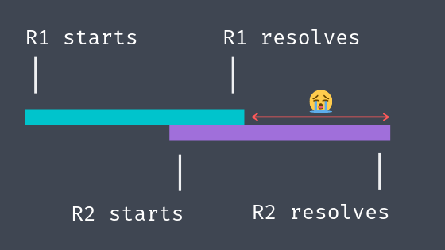
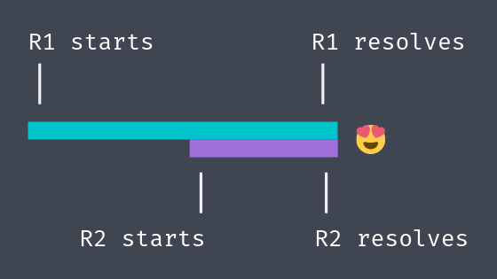

Race conditions?! Javascript?! It's a real thing, I promise!

Let's say you have some service that loads a `User` object from your API. You back the `getById` method with a cache because you're a responsible developer, and you share a single instance across several locations in your app because you want those sweet, sweet cache hits. `UserService` might look something like this:

```typescript
class UserService {
	private readonly userCache: Map<string, User> = new Map()

	async getById(id: string): Promise<User> {
		let user = this.userCache.get(id)
		if (user) return user

		user = await this.fetchById(id)
		this.userCache.set(id, user)
		return user
	}

	private async fetchById(id: string): Promise<User> {
		const response = await fetch(`/users?id=${id}`);
		return User.deserialize(response.body);
	}
}
```

Looks pretty good, right? Can you spot the bug?

It's a little hard to trigger. Let's say that you have two consumers of this api. Imagine the first fires of a request for user `10`. Then, while that request is still in flight, another consumer fires off a request for that same user. Since the service is backed by a cache you're happy to fire off requests willy-nilly.

What happens is there are *two* requests that end up in flight, wasting precious time. Here's a visual:



So much wasted time! Luckily, the fix is pretty simple. Instead of caching the `User`, why don't we cache the promise instead?

```diff
class UserService {
-	private readonly userCache: Map<string, User> = new Map()
+	private readonly userCache: Map<string, Promise<User>> = new Map()

	async getById(id: string): Promise<User> {
		let user = this.userCache.get(id)
		if (user) return user

- 	user = await this.fetchById(id)
+ 	user = this.fetchById(id)
		this.userCache.set(id, user)
		return user
	}

	private async fetchById(id: string): Promise<User> {
		const response = await fetch(`/users?id=${id}`);
		return User.deserialize(response.body);
	}
}
```

That's seriously all it takes. Due to implicit flattening of promises*, we don't have to change anything else. Here's how those requests look now that we're caching the promises rather than the values:



<br>

*
When I say **implicit flattening**, I am referring to the fact that native promises, when nested, are flattened so that they become a single promise. That is, `Promise.resolve(Promise.resolve(10))` is not of type `Promise<Promise<number>>`, it's actually just `Promise<number>`. Since return values from `async` functions are injected into promises, this means that promises returned from async functions are also flattened. That means the following two functions are effectively equivalent:

```typescript
async function random(): Promise<number> {
	return Math.random()
}

// is the same as ...

function random(): Promise<number> {
	return Promise.resolve(Math.random())
}
```
